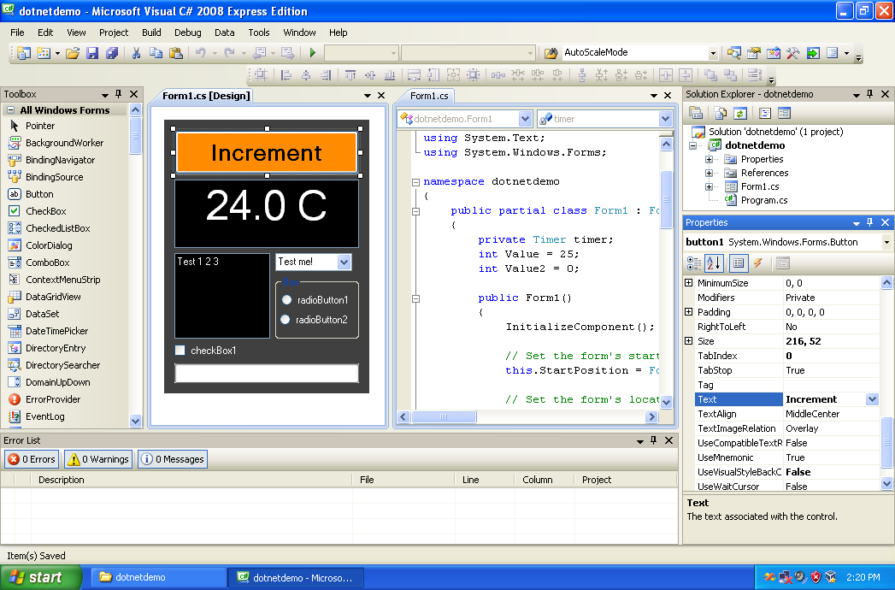
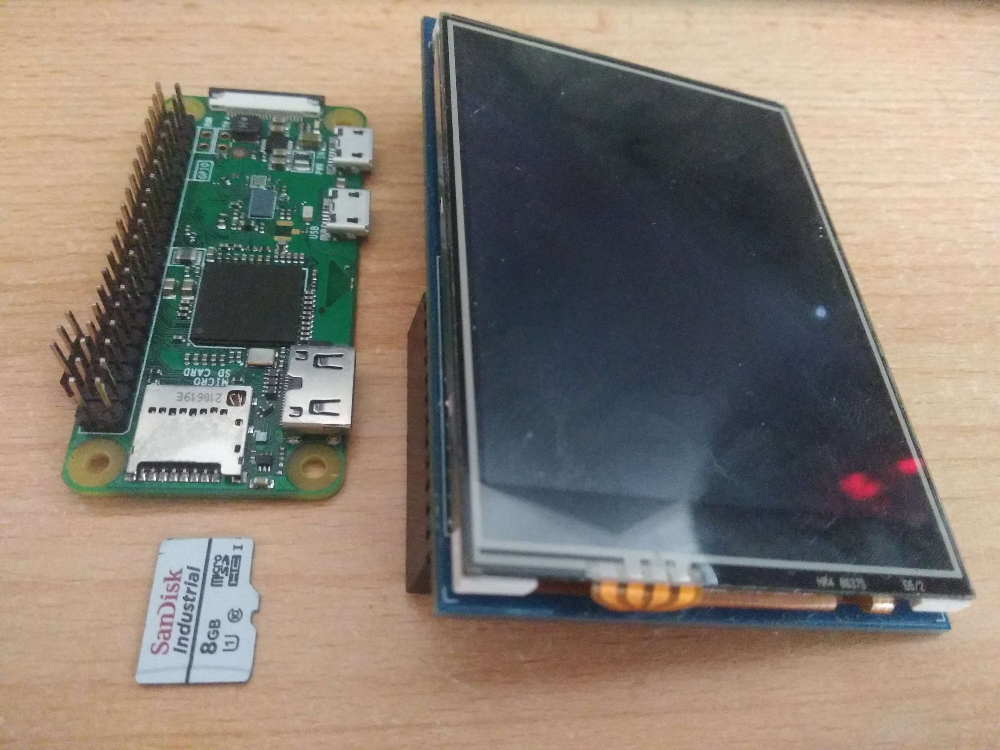
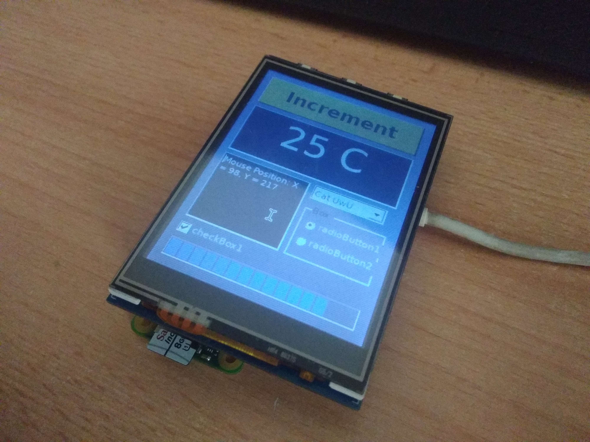

# Raspberry Pi Zero W .NET C# Demo with Buildroot

## Overview
This project demonstrates a proof of concept for porting a legacy, unsupported 
Windows CE industrial application to a modern, supported Linux environment. 
The demo runs on a Raspberry Pi Zero W with a 240x320 SPI display, 
showcasing the potential of using Buildroot to create a minimal Linux 
distribution for such purposes.

## Screenshots and Photos

1. **Original old C# demo**:
   

2. **Raspberry Pi Zero W Setup**:
   
   
3. **Raspberry Pi Zero W Running demo**:
   

### Key changes in Buildroot
1. **Added new packages**:
   - `package/dotnetdemo`: Main .NET demo application package.
   - `package/raspberrypi-lcd-ili9341`: Support for the 240x320 SPI display.
2. **Fixes in packages**:
   - `package/mono`: Applied a patch for cursor size handling.
   - `package/mesa3d`: Disabled NEON instructions requirements

## Getting Started
To replicate this project, follow these steps:

1. **Clone this repository**:
     ```sh
     git clone "https://github.com/MartinK7/buildroot-dotnetdemo-rpi0w.git"
     cd buildroot-dotnetdemo-rpi0w
     ```

2. **Build and Deploy**:
     ```sh
     make raspberrypi0w_defconfig
     make
     ```
3. **Flash the generated image to your microSD card**:
     ```sh
     sudo dd if=output/images/sdcard.img of=/dev/sdX bs=4M
     sync
     ```
     Replace `/dev/sdX` with the appropriate device identifier for your microSD card.

4. **Run the Demo**:
   - Connect the 240x320 SPI display to the Raspberry Pi Zero W.
   - Insert flashed microSD card
   - Power on
   - The .NET C# demo application will starts automatically.
     (It can take longer ~1 minute on slower microSD cards)

## Contributing
Contributions are welcome! Please fork the repository and submit a pull request
with your changes.

## License
This project is licensed under the MIT License.
